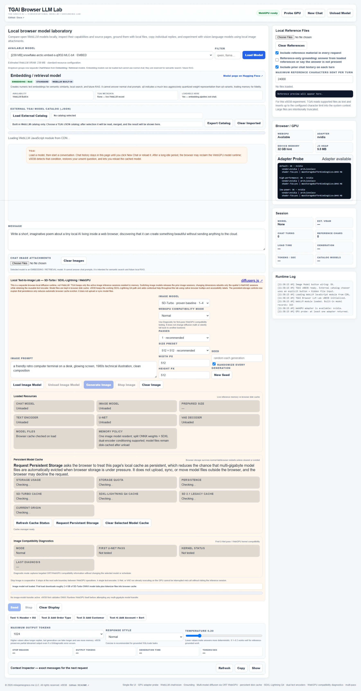

# TGAI Browser LLM Lab

**The Greco AI — Conversational WebLLM + Grounding Lab**

A local-first browser AI playground for experimenting with open language models, embeddings, grounding, vision, and WebGPU image generation.

TGAI Browser LLM Lab is built in the spirit of a **Single-File Local Application (SFLA)**. The application shell is one HTML file and runs directly in a modern browser without an application server. AI runtimes and model weights are optional external resources that the browser downloads and caches locally.

> **No API key. No inference server. Your browser is the AI runtime.**



## Run TGAI Browser LLM Lab

**[▶ Run TGAI Browser LLM Lab in your browser](https://mikejamesgreco.github.io/tgai-browser-llm-lab/)**

Open the hosted version or open `tgai-browser-llm-lab.html` directly in a compatible browser.

The application itself is a single HTML file. On first use, browser AI runtimes and selected model files are downloaded from their upstream sources. Large models may require several gigabytes of local browser storage.

---

## What Is TGAI?

TGAI is an experimental browser-local AI laboratory rather than a hosted chatbot service.

```text
                    Browser
                      │
          ┌───────────┴───────────┐
          │                       │
          ▼                       ▼
      WebLLM / WebGPU       ONNX Runtime WebGPU
          │                       │
          ▼                       ▼
   Local language models    Local image models
          │                       │
          ├────► Chat             ├────► SD-Turbo
          ├────► Grounding        └────► SDXL-Lightning Q4
          ├────► Embeddings
          └────► Vision
```

Prompts and inference can remain in the browser. There is no TGAI inference server.

---

## Core Principles

- **Local-first inference** — compatible models run in the browser.
- **Single-file application shell** — the UI and orchestration code live in one HTML file.
- **No hosted TGAI backend** — the project does not require an application server for inference.
- **Open model experimentation** — browser-compatible open-model catalogs and source information remain visible.
- **Browser-native acceleration** — WebGPU is used where practical for local inference.
- **User-controlled grounding** — local reference files can be attached to the current session.
- **Explicit resource management** — loaded models, GPU memory, browser cache, and persistence are visible and controllable.
- **Experimental by design** — diagnostics and compatibility tools are first-class features.

---

## Important SFLA Distinction

TGAI is intentionally a little different from dependency-free SFLA applications such as TGG Grid.

The **application shell** is a single HTML file, but browser AI is too large to package realistically inside that file. TGAI therefore downloads runtime modules and model assets from upstream projects such as WebLLM, ONNX Runtime Web, Hugging Face model repositories, and tokenizer/runtime resources.

That means:

- The UI/orchestration layer is single-file.
- First use normally requires network access.
- Selected model weights can range from hundreds of megabytes to several gigabytes.
- Model files may be cached by the browser for later reuse.
- After required resources are cached, some workflows may continue to work offline depending on browser storage behavior and origin rules.

TGAI should therefore be considered a **single-file, local-first AI application shell**, not a zero-dependency offline bundle.

---

## Language Models with WebLLM

TGAI uses **WebLLM** for browser-local language-model inference.

The current lab supports:

- Built-in WebLLM model discovery and filtering
- Local model loading
- Streaming chat
- Chat history
- New-chat and unload controls
- Estimated model/VRAM information
- Context inspection
- Output-token controls
- Temperature and response-style controls
- Runtime logging
- GPU probing

The exact model catalog is supplied by WebLLM and can evolve independently of TGAI.

---

## Grounding with Local Reference Files

TGAI can attach local text/reference files to the current browser session.

Current grounding controls include:

- Multiple local reference files
- Optional inclusion on each request
- Reference-only response mode
- Reference character limits
- Context inspection before generation
- Per-turn control over chat history and references

This is currently **full-reference prompt grounding**, not a full vector RAG pipeline.

```text
Local Reference Files
        │
        ▼
 Context Builder
        │
        ├────► System instructions
        ├────► Chat history
        ├────► Current prompt
        └────► Reference material
                    │
                    ▼
              Local WebLLM model
```

---

## Embedding Models

TGAI distinguishes embedding/retrieval models from conversational models.

Embedding models can be discovered and loaded, but normal chat controls are intentionally disabled for them because their purpose is vector representation rather than text generation.

This provides a foundation for future browser-local semantic search and RAG experiments.

---

## Vision Experiments

Compatible vision-language models can use locally selected images as part of a prompt.

Image attachments are downsampled before inference to reduce memory pressure. Vision models can still be significantly heavier than text-only models and should be treated as experimental and model-dependent.

---

## Local Text-to-Image Lab

TGAI also contains a browser-local diffusion image laboratory using **ONNX Runtime Web with WebGPU**.

### SD-Turbo

The lightweight, proven baseline.

- Fast browser-local generation
- 1–4 denoising passes
- Best-known baseline around 512 × 512
- Deterministic output when prompt/settings/seed are reused

### SDXL-Lightning Q4

The heavier, higher-quality browser WebGPU path.

- Quantized SDXL-Lightning U-Net
- Dual SDXL text encoders
- SDXL pooled conditioning and time IDs
- Four-pass Lightning generation
- 1024 × 1024 generation tested successfully in TGAI
- Split external ONNX weight support
- Multi-gigabyte browser cache footprint

### Stable Diffusion 2.1 Base — Legacy / Experimental

Retained as a compatibility test.

The legacy export can load, but on some current Edge/Dawn/ONNX Runtime WebGPU combinations it fails during U-Net execution when a generated `BiasSplitGelu` WebGPU shader is rejected.

TGAI keeps the path visible because compatibility failures are useful data in a browser-AI laboratory.

---

## Image Controls

The image laboratory exposes:

- Model selection
- Prompt
- Seed and random-seed behavior
- Resolution presets and custom dimensions
- Model-specific denoising passes
- Load / unload
- Cooperative stop
- Clear image
- WebGPU compatibility mode
- Runtime progress
- First U-Net-pass diagnostics

---

## WebGPU Compatibility Diagnostics

TGAI can:

- Enable verbose ONNX Runtime logging
- Report first U-Net pass success/failure
- Surface shader/pipeline compatibility failures
- Classify tensor datatype mismatches
- Identify split ONNX external-data failures
- Preserve detailed runtime logs for troubleshooting

---

## Browser / GPU Probe

TGAI can ask the browser for a WebGPU adapter and report basic capability information.

A successful adapter probe does not guarantee that every model or WebGPU kernel will work, but it confirms that the browser can expose a WebGPU device.

---

## Loaded Resources

The image lab reports currently resident resources including:

- Chat model
- Image model
- Prepared image size
- Text encoder(s)
- U-Net
- VAE decoder
- Model cache state
- Memory policy

**Unload Image Model** releases live inference sessions while intentionally preserving browser-cached model files.

---

## Persistent Model Cache

Large browser AI models can take gigabytes of storage, so TGAI includes a cache manager.

It reports browser storage usage, quota, persistence state, per-model cache presence, and the current browser origin.

### Request Persistent Storage

This asks the browser to reduce the chance that cached model files will be automatically evicted when storage space is under pressure.

It does **not** upload files, sync them to a cloud service, reserve GPU memory, permanently lock files on disk, or guarantee that the browser will grant persistence.

### Clear Selected Model Cache

Deletes the selected image model's named browser cache after its inference sessions have been unloaded.

---

## External Model Catalog

TGAI can load an external JSON model catalog in addition to the WebLLM built-in catalog.

This allows curated experimental model lists to be maintained without rebuilding the application.

---

## Browser Storage and `file://`

TGAI can be opened directly as a local HTML file, but browsers apply special origin and storage rules to `file://` documents.

Depending on the browser, Cache Storage behavior, persistent-storage APIs, and other features may work more consistently when TGAI is served from GitHub Pages or another normal HTTPS origin.

The GitHub Pages version is recommended for the most predictable storage behavior.

---

## Privacy

TGAI is designed for local inference, but first-use resource downloads still contact external hosting services.

Typical external network activity can include:

- Loading the WebLLM JavaScript runtime
- Loading ONNX Runtime Web
- Loading tokenizer/runtime modules
- Downloading selected model files from model repositories

After those resources are available, prompt processing and inference are performed locally by the selected browser runtime.

TGAI itself does not operate an inference server that receives prompts.

---

## Getting Started

1. Open **[TGAI Browser LLM Lab](https://mikejamesgreco.github.io/tgai-browser-llm-lab/)** in a recent Chromium-based browser.
2. Confirm **WebGPU Ready** or use **Probe GPU**.
3. Choose a WebLLM model and click **Load Model**.
4. Try the default poem prompt.
5. Optionally attach local references and inspect the next-request context.
6. For images, choose **SD-Turbo** or **SDXL-Lightning Q4**, then click **Load Image Model**.
7. Enter an image prompt and generate locally.
8. Use the unload controls when you want to release memory.

---

## Browser Support

Recent Chromium-based desktop browsers currently provide the best fit, particularly Microsoft Edge and Google Chrome with WebGPU enabled.

A discrete GPU with several gigabytes of available memory is strongly preferred for larger image and language models.

Browser-AI compatibility changes quickly, so a model that loads successfully may still encounter a browser/runtime-specific kernel issue.

---

## Repository Structure

```text
tgai-browser-llm-lab/
│
├── index.html                    # GitHub Pages launcher
├── tgai-browser-llm-lab.html    # Standalone TGAI application
├── screenshot.jpeg              # Project screenshot
├── README.md
└── LICENSE
```

Additional model catalogs, samples, or documentation can be added later without changing the single-file application shell.

---

## Single-File Local Application (SFLA)

```text
Application shell
      │
      ▼
tgai-browser-llm-lab.html
      │
      ├────► Browser APIs
      ├────► WebGPU
      ├────► Local files
      ├────► Browser cache
      └────► Optional external AI runtimes/model assets
```

The goal is to keep the application understandable, portable, and user-controlled while still taking advantage of modern browser-native AI capabilities.

---

## Project Status

TGAI Browser LLM Lab is experimental and under active development.

It is intentionally a place to explore what current browsers can do with open AI models rather than a promise that every model will work on every GPU/browser combination.

---

## Philosophy

TGAI asks a simple question:

> **How much useful AI can live directly in an ordinary web browser?**

```text
No API key.
No TGAI inference server.
No desktop installation.

Just a browser, local compute, and open models.
```

---

## License

License information will be added to the repository's `LICENSE` file.

---

## Author

**Michael J. Greco**

TGAI Browser LLM Lab — **The Greco AI**

© mikejamesgreco.me LLC. All rights reserved.
